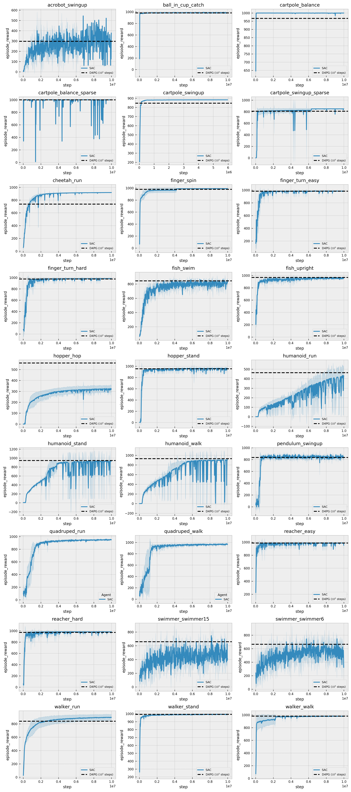

# Soft Actor-Critic (SAC) with Q-Chunking in PyTorch

This is a PyTorch implementation of Soft Actor-Critic (SAC) [[ArXiv]](https://arxiv.org/abs/1812.05905), modified to integrate Q-chunking from the "Q-learning on a temporally extended action space" method. This allows training on a temporally extended action space for faster value propagation.

Key modifications:
- Parameter passing switched from Hydra to argparse for simplicity.
- Added support for action chunking (temporally extended actions) via the `--chunk_size` parameter (default: 5). Set to 1 to recover standard SAC.
- Added variable action step length via actor confidence output and threshold. Use `--confidence_threshold` (default: 0.5) to control the dynamic chunk length based on confidence. The actor outputs a fixed chunk of size h and confidences[h]; the effective length k is the prefix until confidence drops below threshold.

If you use this code in your research project please cite us as:
```
@misc{pytorch_sac,
  author = {Yarats, Denis and Kostrikov, Ilya},
  title = {Soft Actor-Critic (SAC) implementation in PyTorch},
  year = {2020},
  publisher = {GitHub},
  journal = {GitHub repository},
  howpublished = {\url{https://github.com/denisyarats/pytorch_sac}},
}
```

For the Q-chunking method, please refer to the original paper (e.g., "Q-learning on a temporally extended action space" [link if available]).

## Requirements
We assume you have access to a GPU that can run CUDA 9.2. Then, the simplest way to install all required dependencies is to create an Anaconda environment and activate it:
```
conda env create -f conda_env.yml
source activate pytorch_sac
```

## Instructions
To train a standard SAC agent on the `cheetah_run` task run:
```
python train.py --env cheetah_run
```

To enable Q-chunking with chunk size 5 (temporally extended action space):
```
python train.py --env cheetah_run --chunk_size 5
```

To enable variable chunk length with confidence threshold 0.5:
```
python train.py --env cheetah_run --chunk_size 5 --num_train_steps 2000000 --eval_frequency 20000 --experiment va_cheetah_run --confidence_threshold 0.5
```

This will produce an `exp` folder, where all the outputs are going to be stored including train/eval logs, tensorboard blobs, and evaluation episode videos. One can attach TensorBoard to monitor training by running:
```
tensorboard --logdir exp
```

For a full list of command-line options, run `python train.py --help`.

## Results
An extensive benchmarking of SAC on the DM Control Suite against D4PG. We plot an average performance of SAC over 3 seeds together with p95 confidence intervals. Importantly, we keep the hyperparameters fixed across all the tasks. Note that results for D4PG are reported after 10^8 steps and taken from the original paper.
